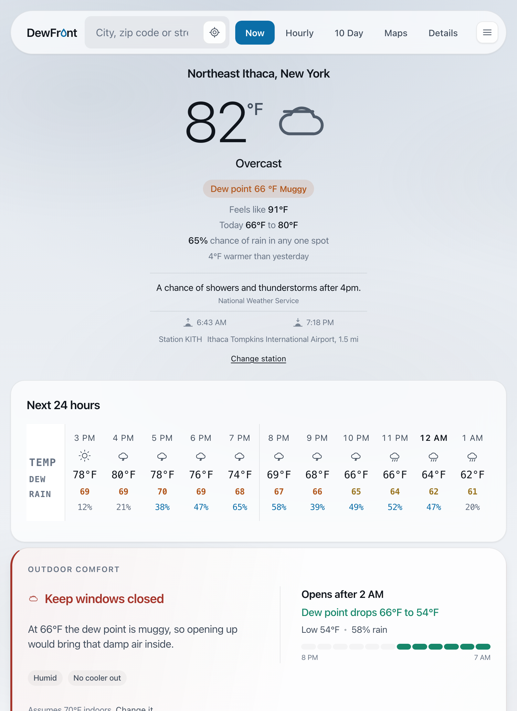
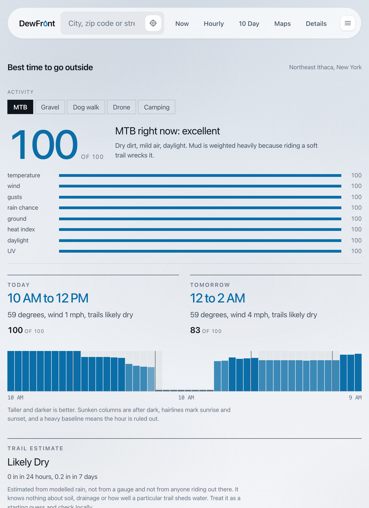
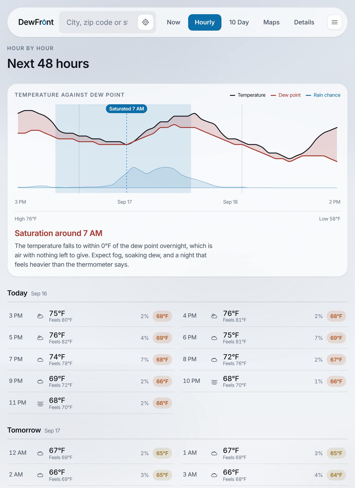
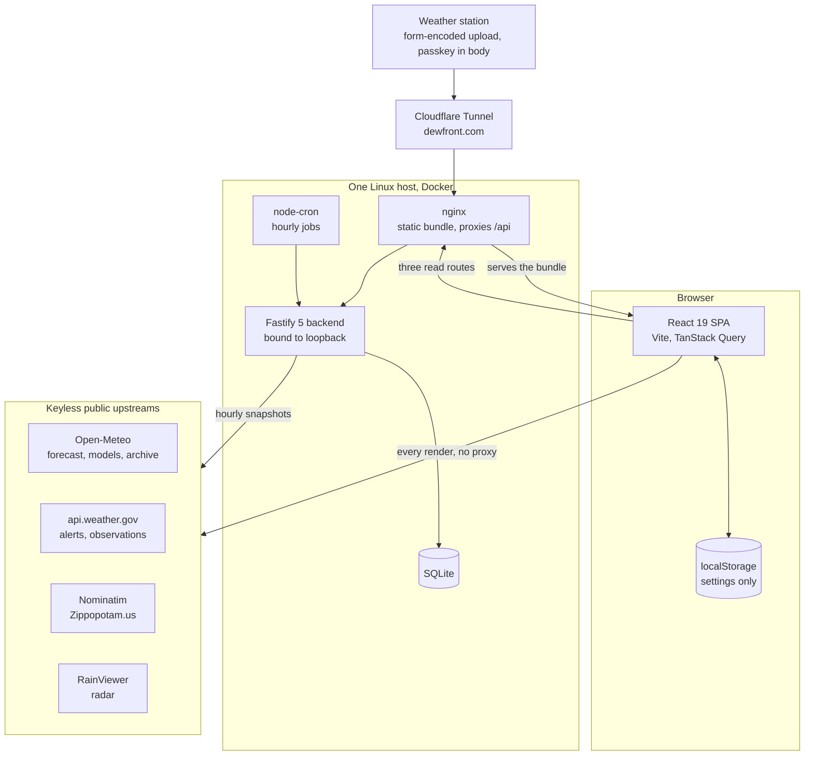
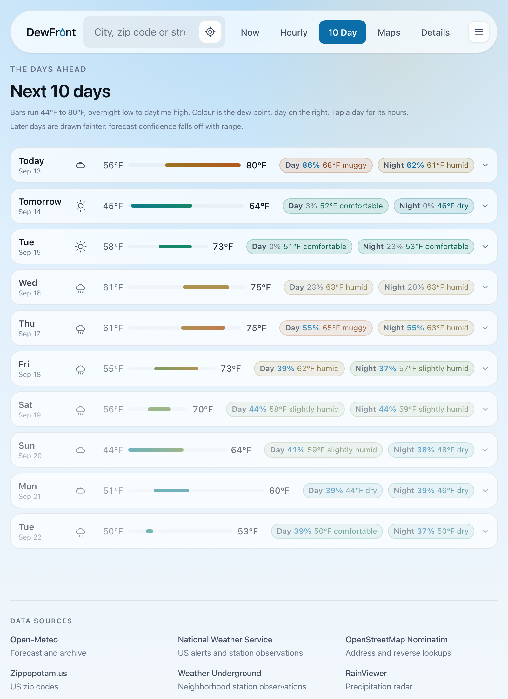
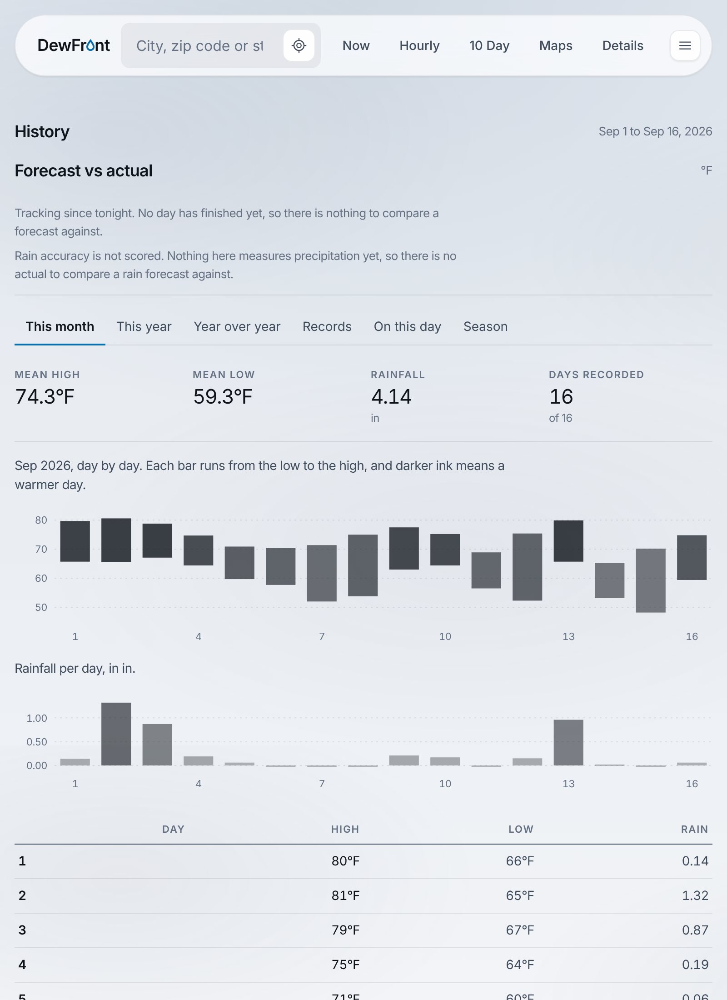
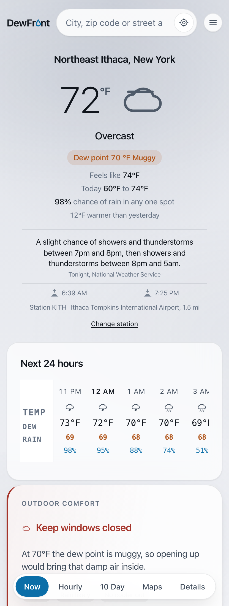

# DewFront

**DewFront is a weather app built for decisions rather than statistics, and it leads with dew point.** Instead of showing you a forecast and leaving the interpretation to you, it answers the questions you actually had: should the windows be open right now, can the AC go off tonight, and which two hour window today is the one worth going outside in.

**Live app:** [dewfront.com](https://dewfront.com)
**Source:** the production repository is private. This repository is the case study: what it does, how it is built, and the engineering decisions behind it.

---

## The problem

Every weather app on a phone buries dew point three taps deep, if it shows it at all. It leads with relative humidity instead, which is the number that cannot answer the question, because it moves with temperature: 90 percent humidity at 50°F is dry air, and 60 percent at 85°F is not.

Dew point does not move with temperature. It is the reading that tells you whether opening a window will help, whether the night will be sleepable, and whether the air is going to feel heavier than the thermometer says. DewFront promotes it to the headline: it sits in the current panel with its comfort word, on every hourly column, on every day of the ten day list, and as its own panel on the details screen with relative humidity underneath it as a footnote. That ordering is the argument of the app expressed as layout.

The second thing it does is refuse to hand you a table and call that an answer. Four thresholds become one verdict, plus one sentence naming the constraint that actually bound it.

## The decision engine

**The overnight rule.** Overnight runs 8 PM to 8 AM. An hour is open when all four of these hold:

| Condition | Threshold |
|---|---|
| Dew point | 60°F or below |
| Outside temperature | below the indoor target, default 70°F, editable |
| Precipitation probability | under 35 percent |
| Wind | under 20 mph |

The verdict is drawn from the longest contiguous run of open hours in that window, which is how "open all night", "open until 5 AM", "open after 11 PM" and "keep them shut" get decided. The card names the binding constraint, because "keep them shut" for a 68°F dew point and "keep them shut" for a 60 percent chance of rain are different nights.

**Dew point comfort bands.** Under 50 is dry, 50 to 55 comfortable, 56 to 60 slightly humid, 61 to 65 humid, 66 to 70 muggy, 71 and up oppressive. Bands are upper inclusive, so exactly 55 is comfortable and 55.4 is slightly humid. The edge cases are pinned by tests because a classifier that disagrees with its own printed legend is worse than no legend.

**Activity scoring.** Every hour of the next 48 is scored 0 to 100 against a chosen profile (mountain bike, gravel, dog walk, drone, camping) using that profile's comfort bands, weights and hard vetoes, and the app names the best two hour window today and tomorrow with a one line reason. For every profile except camping, no recommended window runs past civil dusk, computed from solar geometry for the latitude rather than a flat 30 minutes after sunset. The drone profile refuses outright above 20 mph sustained and flags gust spread separately, because the gust is what puts an aircraft into a tree.

**Insights.** Zero to four short lines, each from a pure detector, ranked danger before warning before info: rain starting or stopping soon, a rapid temperature drop, high wind, dangerous gusts, freeze, frost, heat risk, and three dew point explainers that exist to catch a reader about to misread the obvious number. A quiet day renders nothing at all, with no heading and no all clear line, because a row that always says something is a row nobody reads on the day it matters.

## Data source precedence

Precedence is per field, not per source. The distinction pays off in an ordinary case: a personal weather station with no barometer still yields a real pressure reading from the airport instead of falling back to a modelled one for every field at once.

| Rank | Source | Freshness cutoff |
|---|---|---|
| 1 | Configured personal weather station | 60 minutes |
| 2 | Nearest National Weather Service station | 90 minutes, since ASOS reports hourly |
| 3 | The Open-Meteo model | n/a |

Measured readings carry an accent mark and modelled ones do not. The active source is named under the temperature with its distance and the age of the reading. A station that answered but aged out is shown struck through rather than hidden, so a missing number is never silent. A pinned station stays pinned even once it goes stale, labelled STALE, because silently substituting a different station would make the choice meaningless.

**Modelled is not measured, and the app says so on the row.** Past rain accumulation and the trail surface estimate that depends on it come from a reanalysis estimate for a grid square, not a gauge. Convective summer rain can be out by a factor of two. Presenting those numbers with the authority of a measurement would be the most misleading thing on the page, so they are labelled where they appear rather than in a footnote nobody reads.

**It shows its own uncertainty.** Three independent global models (GFS, ECMWF, ICON) sit side by side for the next three days, and the panel states whether they agree. A forecast that presents one number with total confidence is hiding something the reader would want.

The hourly chart is the clearest example of the thesis. Temperature and dew point share an axis and the gap between the curves is shaded, because that gap is how much room the air has left to hold its moisture. When the curves converge overnight, mugginess builds even as the temperature falls. The convergence is marked on the chart and named in a sentence under it.

## Architecture

The SPA renders entirely from its own upstream calls and does not need the backend to work. The backend exists for the things a browser cannot do, all of which have to happen while nobody is looking: snapshotting forecasts hourly so accuracy can be graded later, composing a daily summary, delivering webhooks when a danger insight first appears, and ingesting uploads from a physical weather station.

### The frontend and backend share domain logic rather than copying it

This is the part worth understanding before changing anything. The `/api/current` route does not have its own idea of what the weather is doing. It calls the same `collectInsights`, `describeConditions`, `evaluateOvernight` and `mergeObservations` functions that the Now screen renders from, and fetches through the same Open-Meteo and NWS clients the browser uses.

The server's TypeScript project includes the shared `lib` and `api` directories in its own compile, so a change to a derived function breaks both builds at once instead of letting the two sides drift into quietly disagreeing about the same forecast. There is no duplicated threshold anywhere in the codebase, and no published internal package to keep in sync either.

Reusing the browser's NWS client on the server was checked rather than assumed. api.weather.gov asks callers to identify themselves with a User-Agent and a browser cannot set one, so the client sends none. Probed from bare Node, both endpoints answered 200 without it, which made a parallel server side client duplication for nothing.

Every derived value is a pure function with the clock passed in as an argument. Nothing in the shared logic reads `Date.now()`. That is what makes one specific night replayable in a test, and what keeps the whole app a pure function of one forecast payload.

## Stack and testing

| Layer | Choice |
|---|---|
| Frontend | React 19, TypeScript 6, Vite 8, TanStack Query with a 15 minute stale time |
| Backend | Node 22+, Fastify 5, better-sqlite3, node-cron |
| Storage | SQLite, bind mounted so it survives every rebuild |
| Delivery | Multi stage Docker build, nginx serving the static bundle, Cloudflare Tunnel |
| Tests | Vitest with v8 coverage, Playwright against mocked upstreams |
| CI | eslint at `--max-warnings 0`, prettier check, unit tests, client build, server build |

There is no component library, no CSS framework and no charting library. Styling is hand written CSS with custom properties, the temperature chart is hand rolled SVG, and the condition marks are custom SVG glyphs rather than an icon pack.

Measured on 2026-08-21 against the current tree:

| Metric | Value |
|---|---|
| Unit tests | 1,778 across 73 files |
| End to end tests | 43 Playwright tests, upstreams mocked |
| Statement coverage | 97.98 percent |
| Branch coverage | 91.55 percent |
| Function coverage | 98.5 percent |
| Source under test | roughly 22,000 lines of TypeScript across 171 non test files |

The tests worth pointing at are not the ones that assert a number renders. They are the ones that assert something is **absent**: relative humidity never appears on the windows decision card, the History archive is not fetched until that screen is opened (the test counts requests to prove it), and switching to Celsius leaves no Fahrenheit anywhere on the Now screen.

## Engineering decisions

Each of these was a real fork with a cheaper option on the other side. Each says what would reverse it.

**Compute the NWS heat index instead of reusing the model's feels like.** Open-Meteo's `apparent_temperature` is a Steadman style figure that folds in wind chill and radiation. It is not the NWS heat index, and every published hydration and exertion guideline is written against the NWS number. The app implements NOAA's reference algorithm, the Rothfusz regression with both published corrections. It is deliberately **not** floored at the air temperature: at 100°F and 10 percent humidity the heat index really is about 94°F, because sweat evaporates freely in very dry air. An earlier draft clamped it, silently cancelling the dry air correction, and a test caught that and now guards it.
*Reverses if:* the guidelines the app is trying to line up with change to a Steadman basis.

**Grade forecasts against the earliest snapshot held, not the latest.** A forecast issued at noon for that same afternoon is barely a forecast, and grading against it would flatter the model. Each date is scored against the longest lead available.
*Reverses if:* the report ever needs to answer "how good was the 6 hour forecast", which is a different question and needs its own column rather than a redefinition of this one.

**Leave the rain accuracy column empty rather than filling it with a model estimate.** The NWS payload carries an hourly precipitation field, and it was probed null at the reference station, as it routinely is at ASOS sites. The model's own estimate is not an actual. So the column stays null and the panel says why.
*Reverses if:* a measuring gauge is wired in, which is exactly what the station ingest path is for.

**Report the sample size so the panel can refuse to draw a conclusion.** Bias is signed forecast minus actual, and `n` counts only the days where both sides of that subtraction existed. It is returned precisely so the UI can decline to say anything from one day of data.
*Reverses if:* nothing. This is the one that keeps the feature honest.

**Turn the LLM daily summary off when it contradicted the tested classifier.** The gateway produced a sentence saying the air was dry at a 59°F dew point, which the app's own classifier calls slightly humid. Untested prose contradicting a tested classifier, on the app's thesis metric, is worse than no prose. The feature is off and the app serves its composed fallback, which is a designed path rather than a degraded one.
*Reverses if:* the classifier's verdict is fed into the prompt as a constraint and the model is allowed to rephrase it but never to classify.

**Fail closed on every write gate.** With the credential variable unset, the routes it guards refuse everything rather than falling open. A deploy that forgets one leaves a working read only site with writes turned off, which is the direction a mistake should go. The boot log reports whether each gate is configured, and never the values.
*Reverses if:* nothing.

**Answer 200 to a rejected station upload.** Consumer weather station firmware has no error handling and no retry, so a 401 would be invisible to it and would present to the owner as a station that had gone offline. The refusal is a log line instead. It also means guessing the passkey against that endpoint tells the guesser nothing.
*Reverses if:* the ingest path is ever fronted by something that can surface an error to a human.

**Round coordinates on the way out of the API.** The location list returns coordinates rounded to three decimals, about 110 metres, and dedupes on the same rounding. It lists places, not people.
*Reverses if:* nothing.

## Security

The instructive part is not the controls, it is when they became necessary.

DewFront was designed and reviewed against a loopback threat model, and the code said so explicitly and correctly: the backend binds to loopback only, and the write routes were reasoned about as reachable only from the local network. Then one commit put the app behind a public tunnel, and every one of those assumptions became false in the same moment. Nothing in the application code changed. Nothing failed. An audit that same day found three high severity issues, all live:

- **Server side request forgery with host control.** Webhook registration accepted any http or https URL with no auth and no private range check, and the container runs on the host network, so the outbound request left from the host itself with its own loopback and local network in reach.
- **Unauthenticated station ingest with no time bound.** The endpoint never validated the passkey the protocol documents, and trusted the timestamp in the body with no future bound, so one request dated four years ahead would pin a forged reading as the latest observation permanently.
- **Full precision coordinates served to anyone.** The location endpoint returned raw stored coordinates, including 15 decimal browser fixes from real visitors, because the summary read path was persisting caller coordinates as a side effect.

All three are fixed and verified from outside the host. Webhook targets are now resolved and re checked before **every** delivery rather than once at registration, because checking once is defeated by DNS rebinding, and the delivery refuses redirects outright, because one `302` to a private address undoes every check above it.

The transferable lesson, and the reason it is written down here: **public ingress is a change to the threat model, not to the deployment.** Before exposing any existing internal service, enumerate every state mutating route and every place a caller supplies a URL or a host, and treat every reassuring comment about "internal only" as an unverified claim about a world that no longer exists.

A cheaper lesson from the same day: three security headers were defined at the server level in nginx and were live on exactly zero responses, because `add_header` does not inherit into a location block that declares its own. One `curl -sSI` from outside proved it. If a control is worth adding, verify it from outside the box rather than by reading the config.

Longer write ups of incidents on these systems: [field-notes](https://github.com/pete-builds/field-notes).

## More screens

  

The app is one bundle at every width. On a phone the header collapses to a wordmark, the search field and a menu, and the tab strip docks to the bottom of the viewport.

## What this repository is not

It is not the source. The production repository is private, and this is a deliberate hold rather than an oversight:

- Publishing is a one way door on the license. Whether DewFront becomes a hosted product is undecided, and that decision wants to be made before the license is fixed, not after.
- The differentiator worth publishing on is the accuracy tracking, which needs weeks of accrued data and a physical station wired in before it says anything interesting.
- If it is ever opened, the right move is a clean export after auditing the whole history for credentials, coordinates, host detail and deployment specifics, not flipping a switch on the existing repository.

## How it was built

I define the requirements, the constraints, the thresholds and what counts as proof. Claude Code writes most of the implementation. What I own is the decision record, which is what this repository is.

The measurements here exist because I decided in advance what would settle a question and then went and got it: the probe that showed the NWS payload's hourly precipitation was null at the reference station, the probe that showed a server side User-Agent was unnecessary, the curl from outside the host that showed three security headers were reaching nobody, and the live sample that caught the LLM contradicting the classifier. Each one changed the design.

## Documentation

- [Architecture](docs/architecture.md), the module map, the shared logic contract, and the request paths
- [Decisions](docs/decisions.md), the long form versions with what was rejected
- [Security](docs/security.md), the threat model, the controls, and how each was verified
