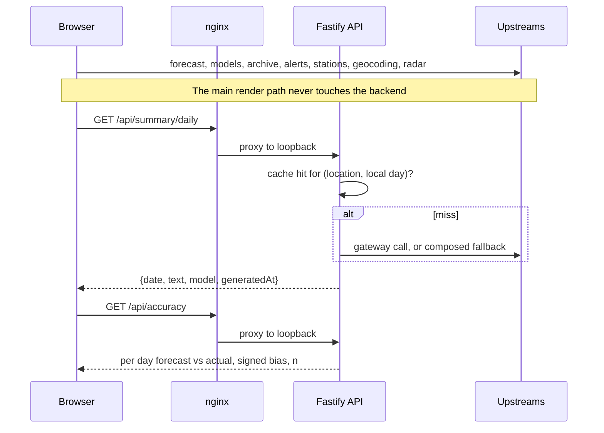

# Architecture

DewFront is two deployable units and one codebase.

## The two units

**The SPA.** A React 19 bundle served by nginx from a multi stage Docker image. It renders entirely from its own calls to public, keyless upstreams. Pull the backend out and the app still works: you lose the daily summary, the accuracy panel and the station reading, and nothing else.

**The backend.** A Fastify 5 service bound to loopback, reached only through the SPA's nginx at `/api/`. It holds a SQLite database and runs hourly cron jobs. It exists for the four things a browser cannot do, all of which have to happen while nobody is looking:

| Job | Why it cannot live in the browser |
|---|---|
| Forecast snapshots | Grading a forecast means recording what was said before the day happened, on a schedule, whether or not a tab is open |
| Daily summary | Holds an API credential, and the result is cached per location per day rather than per visitor |
| Webhook delivery | Fires on the first appearance of a danger insight, which nobody is watching for |
| Station ingest | A weather station uploads to a server; it has no idea a browser exists |

## Request paths



The SPA calls three read routes and nothing else. It has never called a write route.

## Module map

```
src/
  lib/            pure logic, the clock passed in as an argument
    insights/     one detector per file, plus the ranking registry
    outside/      activity scoring, window selection, reason sentences
    history/      archive normalising, records, monthly rollups, growing
                  degree days, on this day, CSV and JSON export, chart geometry
    api/          the wire types both sides import
  api/            upstream clients and the query hooks over them
  state/          settings, persisted to localStorage, and the provider
  screens/        screen composition
  components/     presentation only
  styles/         tokens, then one file per surface

server/
  src/
    lib/          pure backend logic: accuracy comparison, daily actuals, the
                  station parser, prompt composition, summary branching, local
                  day arithmetic, webhook payloads, the error shape
    db/           schema and every query
    routes/       one file per domain
    services/     composition over the shared src/lib functions
    upstream/     the LLM gateway client and webhook delivery
    cron/         the hourly snapshot and the hourly insight sweep
    tools/        a purge tool, so a live smoke test can be reversed exactly

e2e/              Playwright, upstreams mocked, mocks shared between specs
```

## The shared logic contract

The backend's TypeScript project includes the shared `lib` and `api` directories in its own compile. That single line of configuration is the whole enforcement mechanism. What it buys:

- A threshold exists once. The overnight rule's four conditions are defined in one function that both the Now screen and `GET /api/current` call.
- A change to a derived function breaks **both** builds at once. There is no window in which the browser and the server disagree about the same forecast while both compile.
- There is no internal package to publish, version and keep in sync, and no generated client.

The cost is that the two halves cannot diverge in their runtime assumptions. Everything in the shared tree has to work in a browser and in Node, which is why the clock is an argument rather than an import, and why the upstream clients set no headers a browser cannot set.

## Why the clock is an argument

Nothing under the shared logic tree reads `Date.now()`. Every function that needs the current time takes it as a parameter. Three things follow:

1. A specific night is replayable. A test can assert the exact verdict for 8 PM on a named date against a fixed forecast payload.
2. The app is a pure function of one forecast payload plus one timestamp, which makes the entire decision surface testable without mocking time globally.
3. Local day arithmetic, which the daily summary cache and the accuracy report both key on, is explicit rather than implied by the server's timezone.

## Storage

**Server side**, one SQLite file, bind mounted so it survives every rebuild: registered locations (capped, deduped on rounded coordinates), hourly forecast snapshots keyed on target date and lead time, hourly station observations, station uploads with their raw payload, cached daily summaries, webhook URLs, and the active insight state that lets onset dedupe survive a restart. No accounts, no sessions, no personal data. The one genuinely sensitive value is a webhook URL, which is why the listing endpoint returns origins only.

**Client side**, localStorage only: the selected place, saved places, the unit system, the indoor target, the per place station pin, the chosen activity profile, and the optional personal weather station credentials. Malformed or hand edited storage degrades to defaults rather than crashing the app on boot, and a payload written by an older version reads back as simply unconfigured. The activity profile is stored as a bare string rather than a union of known ids, so a profile retired in a later version degrades to the default instead of failing the parse.

## Failure behaviour

Every upstream is treated as optional, and each degradation is specific rather than a generic error state:

| Upstream fails | What the user sees |
|---|---|
| Alerts endpoint (400 outside the US) | No alerts banner, silently |
| Station endpoint (404 outside the US) | The modelled reading, with the source label saying so |
| Air quality | The window verdict computes without an air term |
| Radar above the free tier's zoom limit | Handled explicitly, because that API returns a placeholder tile with HTTP 200 rather than an error |
| The backend entirely | The three panels that need it, and nothing else |
| The LLM gateway | The composed narrative, which is a designed path rather than a fallback in the apologetic sense |

The last one has a specific trap worth recording: pointing the summary at a reasoning model returns HTTP 200 with empty content, because the whole token budget goes to the reasoning channel and never reaches the output. The client treats empty as null and degrades correctly, but it would call the gateway on every single request forever. An empty 200 is not a failure any status code will tell you about.
