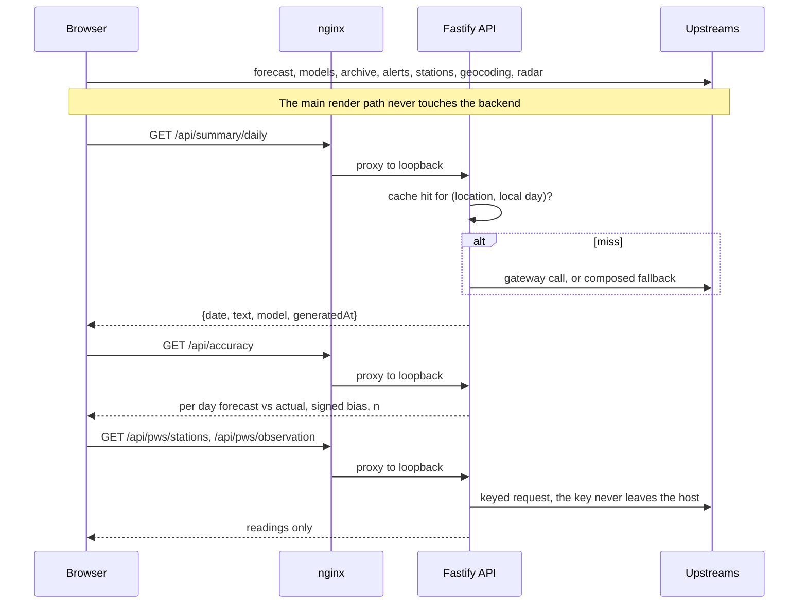

# Architecture

DewFront is two deployable units and one codebase.

## The two units

**The SPA.** A React 19 bundle served by nginx from a multi stage Docker image. It renders the forecast entirely from its own calls to public upstreams, all of them keyless except the CARTO basemap. Pull the backend out and the app still works: you lose the daily summary, the accuracy panel, the neighbourhood station reading and the pollen screen, and nothing else.

**The backend.** A Fastify 5 service bound to loopback, reached only through the SPA's nginx at `/api/`. It holds a SQLite database and runs hourly cron jobs. It exists for the six things a browser cannot do, most of which have to happen while nobody is looking:

| Job | Why it cannot live in the browser |
|---|---|
| Forecast snapshots | Grading a forecast means recording what was said before the day happened, on a schedule, whether or not a tab is open |
| Daily summary | Holds an API credential, and the result is cached per location per day rather than per visitor |
| Webhook delivery | Fires on the first appearance of a danger insight, which nobody is watching for |
| Station ingest | A weather station uploads to a server; it has no idea a browser exists |
| Personal station reads | Holds the Weather Underground key. The SPA asks this service for readings rather than being handed a credential and pointed at the upstream |
| Pollen | Holds the Google Pollen key, and rations it. This upstream is BILLED per request, so the count of calls is a correctness property and not just a performance one: answers are cached for six hours on coordinates rounded to about 11 kilometres, which is coarser than pollen varies and coarse enough that a town shares one billed call. Failures are cached too, because the likeliest two, a location the model does not cover and an exhausted quota, are exactly the ones that would otherwise re-bill on every page load |

A third container, `mcp-weather`, reads the same backend and exposes the forecast, the station readings and the accuracy history to Claude as MCP tools. It is a consumer of the API rather than a part of the app, which is why it can be added and removed without either unit above changing.

## Request paths



The SPA calls five read routes and nothing else: the daily summary, the accuracy report, the nearby personal stations, a personal station's observation, and the latest ingested station reading. It has never called a write route.

The two personal station routes are GETs and so do not pass through the write gate, which is correct rather than convenient: they read public weather data and change nothing. What they must never do is hand back the key that makes them work. Neither errors when the feature is unconfigured either, because "this deployment holds no Weather Underground key" is a deployment state and not a fault in the request somebody just made: the listing answers `status: 'unavailable'` and the observation falls back to the official station, both 200.

## Module map

```
src/
  lib/            pure logic, the clock passed in as an argument
    insights/     one detector per file, plus the ranking registry
    outside/      activity scoring, window selection, reason sentences
    history/      archive normalising, records, monthly rollups, growing
                  degree days, on this day, CSV and JSON export, chart geometry
    api/          the wire types both sides import
  api/            upstream clients and the query hooks over them
  state/          settings, persisted to localStorage, and the provider
  screens/        screen composition
  components/     presentation only
  styles/         tokens, then one file per surface

server/
  src/
    lib/          pure backend logic: accuracy comparison, daily actuals, the
                  station parser, prompt composition, summary branching, local
                  day arithmetic, webhook payloads, the error shape
    db/           schema and every query
    routes/       one file per domain
    services/     composition over the shared src/lib functions
    upstream/     the LLM gateway client and webhook delivery
    cron/         the hourly snapshot and the hourly insight sweep
    tools/        a purge tool, so a live smoke test can be reversed exactly

e2e/              Playwright, upstreams mocked, mocks shared between specs
```

## The shared logic contract

The backend's TypeScript project includes the shared `lib` and `api` directories in its own compile. That single line of configuration is the whole enforcement mechanism. What it buys:

- A threshold exists once. The overnight rule's four conditions are defined in one function that both the Now screen and `GET /api/current` call.
- A change to a derived function breaks **both** builds at once. There is no window in which the browser and the server disagree about the same forecast while both compile.
- There is no internal package to publish, version and keep in sync, and no generated client.

The cost is that the two halves cannot diverge in their runtime assumptions. Everything in the shared tree has to work in a browser and in Node, which is why the clock is an argument rather than an import, and why the upstream clients set no headers a browser cannot set.

## Why the clock is an argument

Nothing under the shared logic tree reads `Date.now()`. Every function that needs the current time takes it as a parameter. Three things follow:

1. A specific night is replayable. A test can assert the exact verdict for 8 PM on a named date against a fixed forecast payload.
2. The app is a pure function of one forecast payload plus one timestamp, which makes the entire decision surface testable without mocking time globally.
3. Local day arithmetic, which the daily summary cache and the accuracy report both key on, is explicit rather than implied by the server's timezone.

## Storage

**Server side**, one SQLite file, bind mounted so it survives every rebuild: registered locations (capped, deduped on rounded coordinates), hourly forecast snapshots keyed on target date and lead time, hourly station observations, station uploads with their raw payload, cached daily summaries, webhook URLs, and the active insight state that lets onset dedupe survive a restart. No accounts, no sessions, no personal data. The one genuinely sensitive value is a webhook URL, which is why the listing endpoint returns origins only.

**Client side**, localStorage and one cache. localStorage holds the selected place, saved places, the unit system, the indoor target, the per place station pin, the chosen activity profile, the optional personal weather station credentials, and the last forecast that arrived, kept for up to three hours so a provider outage costs freshness rather than the whole screen. Cache Storage holds exactly one thing, the app shell (`index.html`, the hashed bundle, the manifest and the icons), written by a service worker whose list of cacheable URLs is fixed at build time. No reading of any kind is ever in that cache, and no request to `/api/` or to any upstream is intercepted by the worker at all. Malformed or hand edited storage degrades to defaults rather than crashing the app on boot, and a payload written by an older version reads back as simply unconfigured. The activity profile is stored as a bare string rather than a union of known ids, so a profile retired in a later version degrades to the default instead of failing the parse.

## Failure behaviour

Every upstream is treated as optional, and each degradation is specific rather than a generic error state:

| Upstream fails | What the user sees |
|---|---|
| Open-Meteo forecast, while online | The last forecast that loaded, revalidated on every mount, for up to three hours; past that, an honest error |
| Alerts endpoint (400 outside the US) | No alerts banner, silently |
| Station endpoint (404 outside the US) | The modelled reading, with the source label saying so |
| Air quality | The window verdict computes without an air term, and the Details panel is absent rather than empty |
| Pollen, unconfigured or uncovered | Its own screen says which of the two it is, in different words, because they send a reader to different places. Nothing else on the site changes |
| Radar above the free tier's zoom limit | Handled explicitly, because that API returns a placeholder tile with HTTP 200 rather than an error |
| The backend entirely | The three panels that need it, and nothing else |
| The network entirely | The shell opens from the service worker's cache and says the forecast cannot be reached. It shows no number, even though the last forecast is sitting in localStorage: offline is decided by the browser's own online flag, not by whether something is stored. A provider outage while online is the different case above |
| The LLM gateway | The composed narrative, which is a designed path rather than a fallback in the apologetic sense |

The last one has a specific trap worth recording: pointing the summary at a reasoning model returns HTTP 200 with empty content, because the whole token budget goes to the reasoning channel and never reaches the output. The client treats empty as null and degrades correctly, but it would call the gateway on every single request forever. An empty 200 is not a failure any status code will tell you about.
